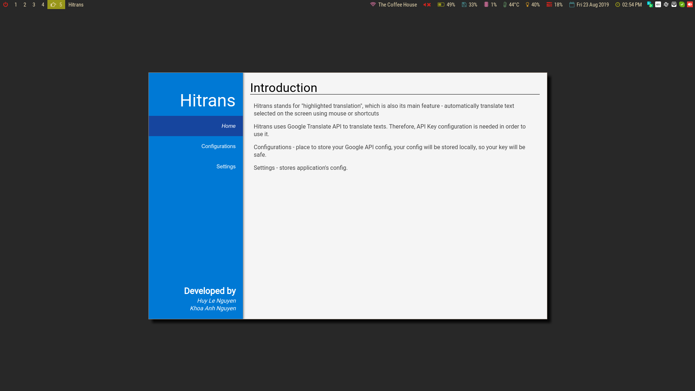
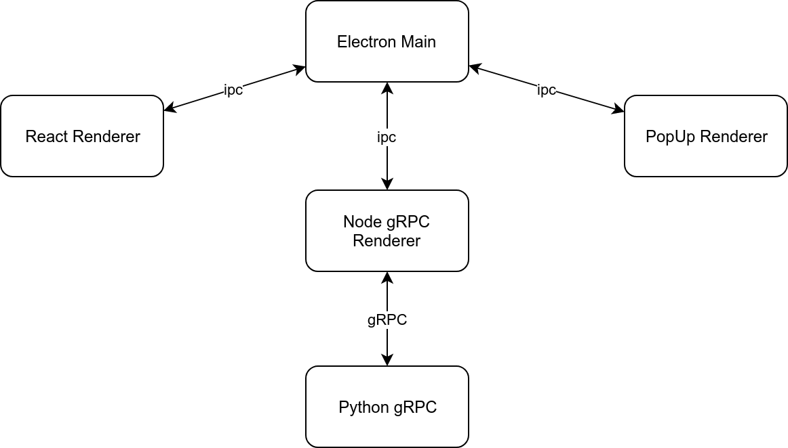

# Highlighted Text Translation (Hitrans)

## Preview




## Setup

### Install

```bash
npm install
./node_modules/.bin/electron-rebuild
pip install grpc grpc-tools
```

### Generate grpc python code

```bash
# At the root directory of python grpc (e.g "hitrans/rpc")
python3 -m grpc_tools.protoc -I../rpc --python_out=. --grpc_python_out=. ../rpc/protos/*.proto
```

### Run

Open a terminal and type:

```bash
npm start
```

Open another terminal and type:

```bash
python ./rpc/main.py
```

## Operation Mechanism



### Ipc

Electron Architecture has 1 **Main Process** and Many **Renderer Processes**.

**Renderer Processes** communicates with each other via **Main Process**.

**Renderer Process** communicates with **Main Process** via **Electron IPC Mechanism**.

#### React Renderer

React is the main frontend of the application.

#### PopUp Renderer

PopUp is a frameless window implemented in pure _html_ codes.

#### Node gRPC Renderer

This process holds an important role in the application. The **gRPC Second Services** will be running in this process as **Node gRPC Server** to handle _PopUp_ request from **Python gRPC Client** where the **gRPC First Services** will be the **Node gRPC Client** that sends requests to **Python gRPC Server**.

### gRPC

Electron Main Process uses Node gRPC to create independent client and server
processes to communicate with Python gRPC processes via sockets.

#### gRPC First Services

1. Create Config File
2. Get Config File
3. Write Config File

#### gRPC Second Services

1. PopUp (show translated text in frameless window)

#### Python gRPC Server

This process will use the **gRPC First Services** as **Python gRPC Server** to handle requests made from **Node gRPC Client**.

#### Python gRPC Client

This process will use the **gRPC Second Services** as **Python gRPC Client** to make requests to **Node gRPC Server**.

This process has following services:

1. Detect mouse position
2. Detect mouse clicks, double click.
3. Get primary selection text of the OS.
4. Detect keyboard shortcuts.
